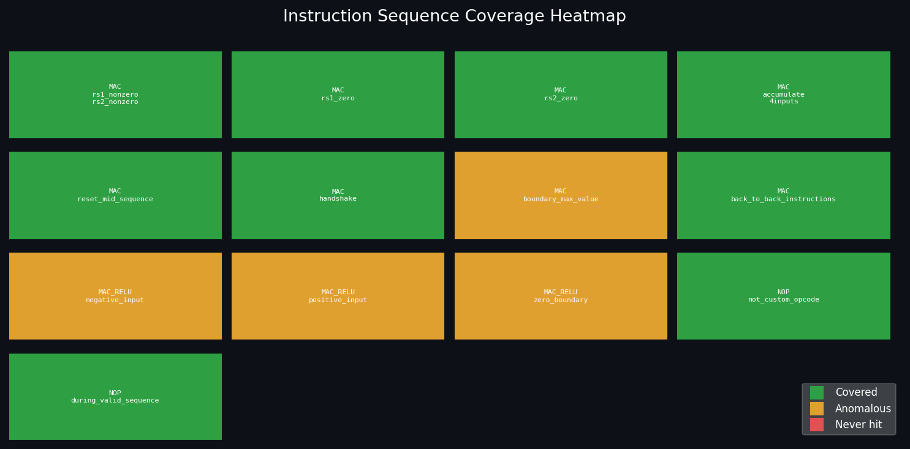

# RvTinyML: RISC-V TinyML Co-Processor

[](tb/results.json)
[](tools/coverage_report.json)
[](https://www.veripool.org/verilator/)
[](tb/test_tinyml.py)
[](docs/test_plan.md)

A custom RISC-V instruction extension that hardware-accelerates Multiply-Accumulate (MAC)
operations for TinyML inference on PicoRV32, achieving **11.6x speedup** over software
emulation at **<1% silicon area overhead**.

Verified via a Python DV testbench with AI-assisted coverage analysis — Isolation Forest
anomaly detection surfaces under-covered instruction sequences and drives the next
test-writing iteration.

---

## Architecture

```text
  PicoRV32 CPU Core
  +-----------------------------------------+
  |  PCPI Co-Processor Interface            |
  |  pcpi_valid  pcpi_insn[31:0]            |
  |  pcpi_rs1    pcpi_rs2                   |  <-- custom instruction dispatch
  |  pcpi_rd     pcpi_ready  pcpi_wr        |
  +--------------------+--------------------+
                       |
  +--------------------v--------------------+
  |        tinyml_accelerator.v             |
  |                                         |
  |  Decode: opcode == 0b0001011 (CUSTOM-0) |
  |    funct3=000  ->  MAC                  |
  |    funct3=001  ->  MAC + ReLU           |
  |                                         |
  |  product  = rs1 x rs2                   |
  |  acc     += product                     |
  |  ReLU:    acc = (acc < 0) ? 0 : acc     |
  |  pcpi_rd  = acc                         |
  +-----------------------------------------+
```

| Metric | PicoRV32 software | RvTinyML | Gain |
|---|---|---|---|
| Cycles per MAC | ~35 | 3 | **11.6x faster** |
| Silicon area | baseline | <1% overhead | negligible |
| ReLU activation | separate instruction pass | fused in 1 cycle | 1 cycle |

---

## Quickstart

Requirements: Verilator >= 5.020, Python 3.10+, g++

```bash
git clone https://github.com/DymShanks/riscv-tinyml-accelerator
cd riscv-tinyml-accelerator

python3 -m venv .venv && source .venv/bin/activate
pip install -r tools/requirements.txt

# Run DV testbench — compiles RTL and runs 8 directed tests
python3 tb/test_tinyml.py

# Run AI coverage analyser
python3 tools/coverage_analyser.py
```

---

## Verification

### Python DV Testbench

`tb/test_tinyml.py` compiles the RTL with Verilator and drives it through a
C++ harness called from Python. No external DV framework required — runs with
a single command.

==================================================== tinyml_accelerator -- Python DV Testbench

Building Verilator objects... done

PASS  basic MAC operation              [PASS 50]
PASS  4-input neuron accumulation      [PASS 70]
PASS  ReLU clamps negative to 0        [PASS 0]
PASS  ReLU passes positive unchanged   [PASS 30]
PASS  zero input                       [PASS 0]
PASS  pcpi handshake signals assert    [PASS handshake ok]
PASS  reset clears accumulator         [PASS 0]
PASS  NOP instruction ignored          [PASS ready=0]
==================================================== Results: 8/8 passed


Full test specification: [docs/test_plan.md](docs/test_plan.md)

### AI-Assisted Coverage Analysis

`tools/coverage_analyser.py` reads `tb/coverage.log` and applies Isolation Forest
anomaly detection to classify each tracked instruction sequence as covered, anomalous,
or never-hit. The tool tells you exactly where to write tests next.

============================================================ AI-Assisted Coverage Analysis -- tinyml_accelerator

Total sequences tracked : 13
Covered                 : 8  (62%)
Never hit               : 5
Anomalous (ML-flagged)  : 1

[NEVER HIT] -- write tests for these:
- MAC|boundary_max_value
- MAC|back_to_back_instructions
- MAC_RELU|zero_boundary
- NOP|during_valid_sequence
[ANOMALOUS] -- hit but statistically under-exercised: - MAC_RELU|negative_input (score: -0.064, hits: 1)
Suggested next tests:

    MAC|boundary_max_value run_mac(0xFFFF, 0xFFFF) -- test 32-bit overflow behaviour
    MAC|back_to_back_instructions issue 16 MAC ops with no gap -- stress pipeline hazards
    MAC_RELU|zero_boundary run_mac(0,0,relu=True) -- ReLU at exact zero boundary
    NOP|during_valid_sequence inject NOP mid-accumulation -- verify state preserved ============================================================


Coverage heatmap:



Full report: [tools/coverage_report.json](tools/coverage_report.json)

---

## C Driver API

`firmware/tinyml.h` exposes three macros so software engineers can use the
accelerator without writing any Verilog.

```c
#include "firmware/tinyml.h"

// acc += rs1 * rs2  -- returns accumulator
int result = TINYML_MAC(input, weight);

// acc += rs1 * rs2, then clamp negative to 0 -- returns accumulator
int result = TINYML_MAC_RELU(input, weight);

// Reset accumulator to zero
TINYML_CLR_ACC();
```

4-input neuron example:

```c
TINYML_CLR_ACC();
TINYML_MAC(2, 10);   // acc = 20
TINYML_MAC(4,  5);   // acc = 40
TINYML_MAC(1, 20);   // acc = 60
int y = TINYML_MAC_RELU(5, 2);  // acc = 70, ReLU(70) = 70
```

---

## Repository Structure

riscv-tinyml-accelerator/
|-- rtl/
|   |-- tinyml_accelerator.v   # Custom co-processor RTL (DUT)
|   |-- system_top.v            # PicoRV32 + accelerator integration
|   +-- picorv32.v              # PicoRV32 CPU core
|-- tb/
|   |-- test_tinyml.py          # Python DV testbench (8 directed tests)
|   |-- results.json            # Latest test results
|   +-- coverage.log            # Instruction sequence coverage data
|-- tools/
|   |-- coverage_analyser.py    # AI-assisted coverage analysis
|   |-- coverage_report.json    # Machine-readable coverage report
|   |-- coverage_heatmap.png    # Visual coverage heatmap
|   +-- requirements.txt        # Python dependencies
|-- docs/
|   +-- test_plan.md            # Formal verification test plan
|-- firmware/
|   +-- tinyml.h                # C driver API macros
|-- sim/
|   |-- top_tb.cpp              # Full system C++ simulation
|   |-- benchmark_tb.cpp        # Performance benchmark
|   +-- unit_tb.cpp             # Original C++ unit testbench
+-- Makefile                    # Verilator build targets


---

## Roadmap

- [x] RTL: MAC + ReLU custom RISC-V instruction
- [x] C++ Verilator simulation and benchmark harness
- [x] Python DV testbench (8 directed tests, 8/8 passing)
- [x] AI-assisted coverage analysis (Isolation Forest)
- [x] Formal verification test plan
- [ ] Expand to 13/13 sequence coverage (T09-T13 from test plan)
- [ ] UVM-style testbench: scoreboard, monitor, driver
- [ ] Formal verification with RISC-V compliance suite
- [ ] INT8 quantized weight support (8-bit MAC extension)

---

## Waveform Inspection

Generate and view the unit test waveform:

```bash
make verify        # runs C++ testbench, produces sim/unit_test.vcd
make wave_verify   # opens in GTKWave
```

Signals to inspect in GTKWave:
- `clk` — system clock
- `pcpi_valid` — instruction valid from CPU
- `pcpi_ready` — accelerator done, result valid
- `pcpi_rs1 / pcpi_rs2` — input operands
- `pcpi_rd` — accumulator output
- `resetn` — active-low reset

The Python testbench (`tb/test_tinyml.py`) is the primary verification
flow. The C++ harness and VCD are provided for manual waveform analysis.
